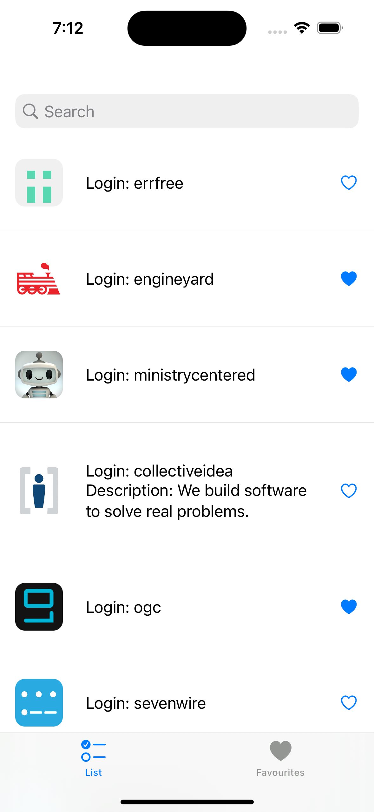
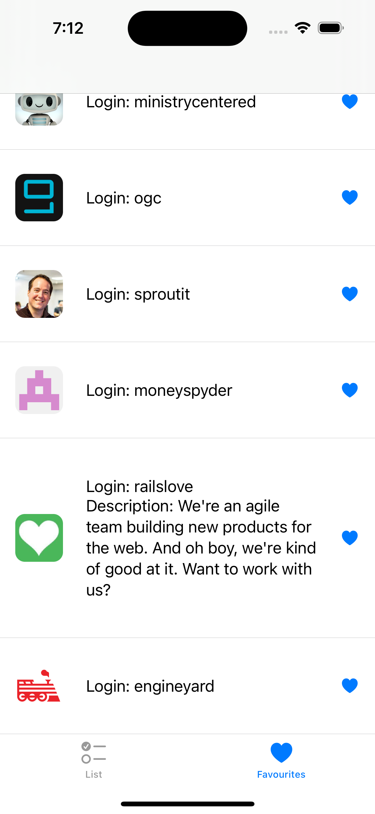
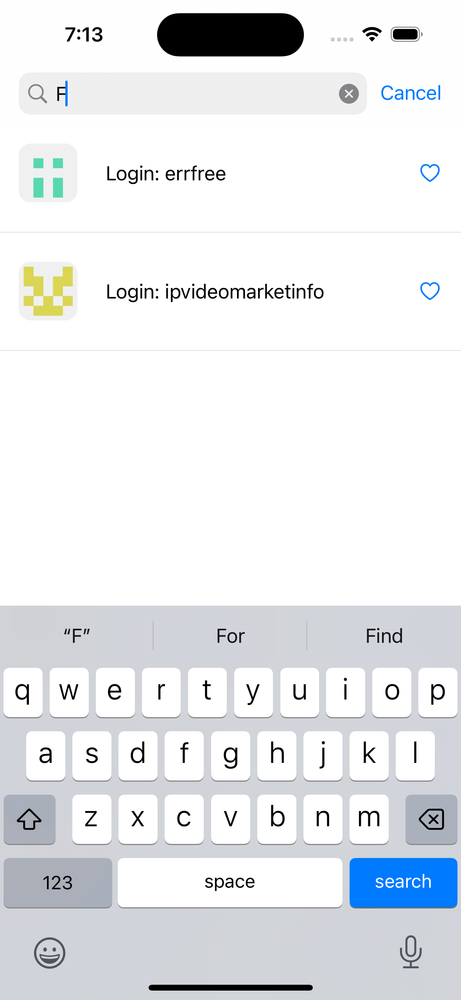

# BrowsrApp

List all organizations in your config

### Listing

### Save

### Search

## Tech Notes
The architecture in this project is MVVM, I focused on making it as simple as possible.
It uses SwiftUI for the views
CoreData for data cache
URL sessions for networking
Combine for data flow

There are a lot of things I wanted to make in this project to make it more robust.

I applied concepts of clean architecture for the use cases, dependency injection, dependency inversion, Open/Closed and some other aspects.
The app consists basically of one screen, which is reused for cache listing as well.
Every view has its own view model with the respetive data, when necessary there's some logic in it. The main parts of the logic is abstracted through protocols.

